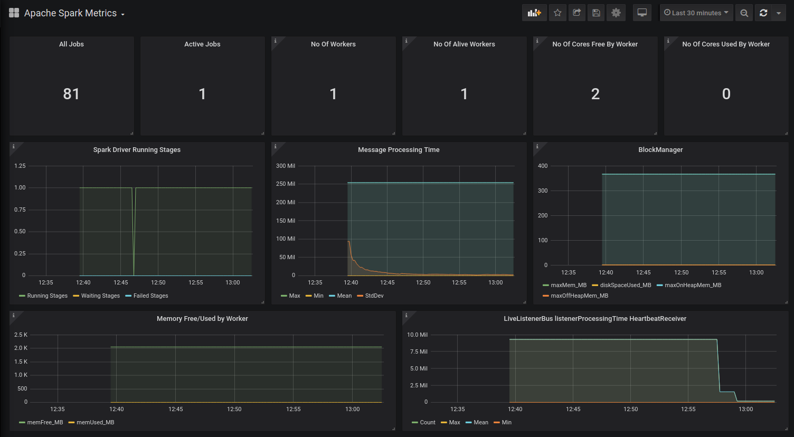
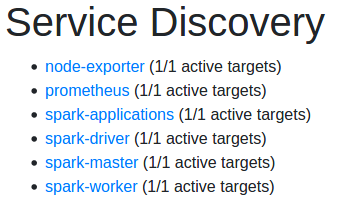

# Monitoring Apache Spark and HDFS on Docker with Prometheus and Grafana

## Goal
The goal of this project is to:
- Create a Docker Container that runs Spark on top of HDFS
- Use Prometheus to get metrics from Spark applications and Node-exporter
- Use Grafana to display the metrics collected

## Configuration
- Hadoop Configurations for core-sites.xml and hadoop-env.sh are set [here](https://github.com/nikoshet/monitoring-spark-on-docker/blob/0b363ce7f0586ea9041e270e1a4fb7abfb6e52b5/Spark/install.sh#L27).
- Spark Configurations for spark-env.sh and spark-defaults.conf are set [here](https://github.com/nikoshet/monitoring-spark-on-docker/blob/0b363ce7f0586ea9041e270e1a4fb7abfb6e52b5/Spark/install.sh#L53).
- Environment variables for Spark/Hadoop versions and library paths are set [here](https://github.com/nikoshet/monitoring-spark-on-docker/blob/0b363ce7f0586ea9041e270e1a4fb7abfb6e52b5/Spark/Dockerfile#L6).

## Notes
- Spark version running is 3.0.1, and HDFS version is 3.2.0.
- For all available metrics for Spark monitoring see [here](https://spark.apache.org/docs/2.2.0/monitoring.html#metrics).
- The containerized environment consists of a Master, a Worker, a DataNode, a NameNode and a SecondaryNameNode.
- To track metrics across Spark apps, appName needs to be set up or else the spark.metrics.namespace will be spark.app.id that changes after every invocation of the app.
- Main Python Application running is app.py that is an example application computing number pi. For your own application/use of HDFS please do changes accordingly.
- Dockerfile for Spark/Hadoop is also available [here](https://hub.docker.com/repository/docker/nikoshet/spark-hadoop/general) in order to add it in docker-compose.yaml file as seen [here](https://github.com/nikoshet/monitoring-spark-on-docker/blob/820dee01d771e8cf6ec3a7b27ede8aa0eeef2214/docker-compose.yaml#L54).

## Usage
Assuming that Docker is installed, simply execute the following command to build and run the Docker Containers:
```
docker-compose build && docker-compose up
```
## Screenshots
- Example dashboard for Spark Metrics:
<div style="display:block;margin:auto;height:80%;width:80% text-align:center;">
  
</div>

- All available services from Service Discovery in Prometheus:
<div style="display:block;margin:auto;height:40%;width:40%; text-align:center;">
  
</div>

## Troobleshooting
Please file issues if you run into any problems.